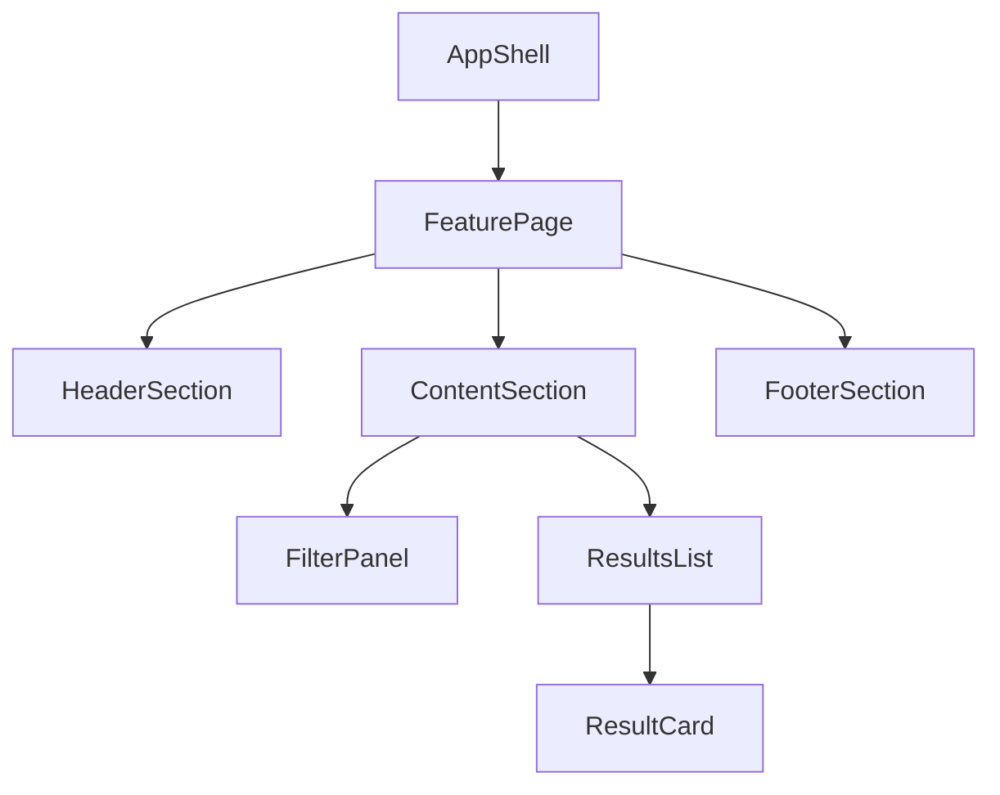

# Component Hierarchy Reference

## Table of Contents

- Output Templates
- Vue Scaffold Template
- Composable Scaffold Template
- Hierarchy Heuristics
- State Placement Heuristics
- Common Anti-Patterns
- Prompt Starters

## Output Templates

### 1) Hierarchy Tree Template



### 2) Component Contract Table Template

| Component     | Parent           | Children                          | Owns State            | Inputs (Props)       | Outputs (Events) | Composables          | Notes                 |
| ------------- | ---------------- | --------------------------------- | --------------------- | -------------------- | ---------------- | -------------------- | --------------------- |
| `FeaturePage` | `AppShell`       | `HeaderSection`, `ContentSection` | `filters`, `viewMode` | route params         | `onFilterChange` | `useFeatureFilters`  | Route-level container |
| `ResultsList` | `ContentSection` | `ResultCard`                      | none                  | `items`, `isLoading` | `onSelectItem`   | none                 | Presentational list   |

### 3) Implementation Sequence Template

1. Implement route/container shells.
2. Implement stateful feature containers.
3. Implement shared presentational components.
4. Wire events and side effects.
5. Add tests and accessibility checks.

## Vue Scaffold Template

Use this as the default output for each Vue component file generated by this skill.

```vue
<script setup lang="ts">
interface ExampleComponentProps {
  // Define props interface first.
  // 對展示層（Leaf 元件），優先使用 primitive-based props (string, number, boolean)
  // 對容器/區段元件，可適時使用 domain-specific object (例如 userInfo: User) 以避免 prop-drilling
  title?: string;
}

const props = withDefaults(defineProps<ExampleComponentProps>(), {
  title: ''
});
void props;

// Optional: when typed emits are required, follow AGENTS.md
// "Vue SFC Code Style（Single Source）".
</script>

<template>
  <div class="ExampleComponent">
    <!-- Keep only the root element in scaffold output. -->
    ExampleComponent
  </div>
</template>

<style lang="scss" scoped>
.ExampleComponent {
  // Keep only the root style block in scaffold output.
}
</style>
```

Scaffold constraints:

- Do not implement feature content inside template.
- Do not add API calls, computed/watch logic, emits wiring, or child composition.
- Use AGENTS.md "Vue SFC Code Style（Single Source）" for all shared Vue SFC style rules.
- Keep the file minimal and compile-safe.

## Composable Scaffold Template

Use this as the default output for each TypeScript Composable file generated by this skill.

```typescript
// useExampleFeature.ts

export interface ExampleFeatureParams {
  // Define hook input parameters here
}

export interface ExampleFeatureResult {
  // Define exposed reactive state or methods here
}

export const useExampleFeature = (params: ExampleFeatureParams): ExampleFeatureResult => {
  void params;
  
  // Return minimum compilable structure with mock data/functions
  return {} as ExampleFeatureResult;
};
```

## Hierarchy Heuristics

- Split a node when it has more than one reason to change.
- Keep data-fetching near route/feature boundaries unless there is a clear shared cache strategy.
- Keep leaf components focused on rendering and interaction handling.
- Prefer one-way data flow: parent owns orchestration, child reports intent.

## State Placement Heuristics

- Put state in the lowest common ancestor of all consumers.
- Lift state only when multiple siblings consume or coordinate on it.
- Use global state only for cross-route or cross-feature concerns.
- Keep transient UI state local (`isOpen`, `isHovered`, temporary form inputs).

## Common Anti-Patterns

- Creating `Shared` components before real reuse exists.
- Mixing API calls directly inside presentational leaves.
- Passing entire data models when only a small subset is needed (on presentation level).
- Deep prop-drilling without considering composition or context/store boundaries.
- Building highly generic components with unclear ownership.
- Pre-implementing business logic in scaffold phase.
- Adding multiple wrappers instead of a single root class block.

## Prompt Starters

- "Design a component hierarchy for this dashboard with reusable cards and filters."
- "Break this wireframe into React components and define state ownership."
- "Propose a Vue component tree and implementation order for this feature."
- "Generate Vue component scaffold files using script-setup TS and root-only template/style blocks."
- "為此儀表板產出組件樹與骨架，請直接輸出 Phase 1 與 Phase 2 內容，不需等待確認。"
