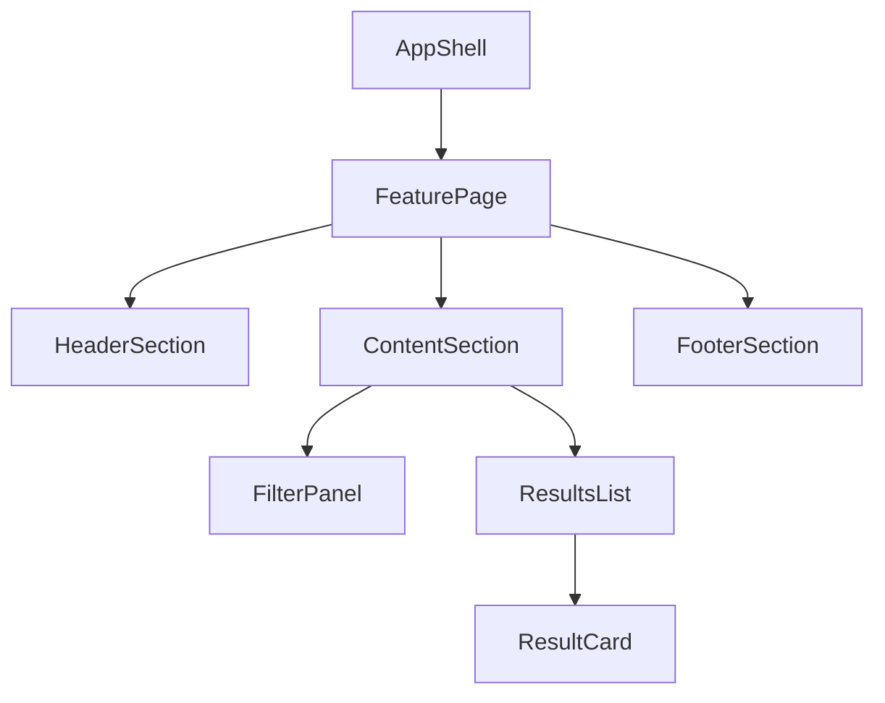

# Component Hierarchy Reference

## Table of Contents

- Output Templates
- View Model Mock Data Design Example
- Vue Scaffold Template
- Composable Scaffold Template
- Hierarchy Heuristics
- State Placement Heuristics
- Common Anti-Patterns

## Output Templates

### 1) Hierarchy Tree Template



### 2) Component Contract Table Template

| Component     | Parent           | Children                          | Owns State            | Inputs (Props)       | Outputs (Events) | Composables          | Notes                 |
| ------------- | ---------------- | --------------------------------- | --------------------- | -------------------- | ---------------- | -------------------- | --------------------- |
| `FeaturePage` | `AppShell`       | `HeaderSection`, `ContentSection` | `filters`, `viewMode` | route params         | `onFilterChange` | `useFeatureFilters`  | Route-level container |
| `ResultsList` | `ContentSection` | `ResultCard`                      | none                  | `items` (ViewModel)  | `onSelectItem`   | none                 | Presentational list   |

### 3) Implementation Sequence Template

1. Implement route/container shells.
2. Implement stateful feature containers (injecting ViewModel Mock Data).
3. Implement shared presentational components.
4. Wire events and local UI states.
5. Add verification and styling skeleton.

## View Model Mock Data Design Example

在進行 UI 元件樹設計時，應同時給出 UI 最理想的 View Model 資料結構。這有助於徹底與後端 API 解耦。

```json
{
  "summary": {
    "totalCount": 128,
    "activeCount": 92
  },
  "items": [
    {
      "id": "item-1",
      "displayTitle": "專案 A (啟用中)",
      "statusTag": "active",
      "updatedAtLabel": "2 小時前"
    }
  ]
}
```
*說明：`displayTitle` 與 `updatedAtLabel` 皆為 UI 渲染直接需要的標準欄位，避開在呈現元件內做字串拼接或日期計算。*

## Vue Scaffold Template

每個 Vue 元件檔案的預設骨架輸出。格式必須遵循根目錄 `AGENTS.md` 的 `Vue SFC Code Style（Single Source）`。

```vue
<script setup lang="ts">
interface ExampleComponentProps {
  // 對展示層（Leaf 元件），優先使用 primitive-based props (string, number, boolean)
  // 對容器或區段組件，使用設計好的 View Model 結構傳入以避免 prop-drilling
  title?: string;
}

const props = withDefaults(defineProps<ExampleComponentProps>(), {
  title: ''
});
void props;
</script>

<template>
  <div class="ExampleComponent">
    ExampleComponent
  </div>
</template>

<style lang="scss" scoped>
.ExampleComponent {
  // 僅保留根類名 selector 空 block，不填寫任何 CSS 屬性
}
</style>
```

## Composable Scaffold Template

用作抽離 UI 邏輯之 TypeScript Composable 骨架。

```typescript
// useExampleFeature.ts

export interface ExampleFeatureParams {
  // Hook 的傳入參數
}

export interface ExampleFeatureResult {
  // 暴露給 UI 元件的反應式狀態與方法 (例如 viewModel, toggleStatus 等)
}

export const useExampleFeature = (params: ExampleFeatureParams): ExampleFeatureResult => {
  void params;
  
  // 回傳最小可編譯結構與 mock 資料/方法
  return {} as ExampleFeatureResult;
};
export { useExampleFeature };
```

## Hierarchy Heuristics

- **單一職責原則**：當一個元件有大於一個改變的理由時，應考慮拆分。
- **無副作用的呈現層**：展示型葉元件應維持純粹渲染，不包含任何 API 呼叫。
- **單向資料流**：父元件掌管 ViewModel / Mock 資料與協調，子元件透過 emit 提報意圖。

## State Placement Heuristics

- 狀態應保留在消費該狀態的「最低共同祖先」元件中。
- 僅在多個兄弟元件需要共用或協調該狀態時，才將狀態上提到容器層。
- 區域互動狀態（如 `isOpen`, `isLoading`）應保留在本地元件中。

## Common Anti-Patterns

- ❌ **直接將 API 欄位曝露在 UI 元件中**（例如 `item.project_created_date` 而不是 `item.updatedAtLabel`）。
- ❌ **在設計 UI 骨架時就寫入 API 呼叫或 stateful 邏輯**。
- ❌ **沒有規劃好 View Model 的 Mock Data 結構就開始切分元件**。
- ❌ **過早地將本地 UI 狀態提升到全域 Store 中**。
