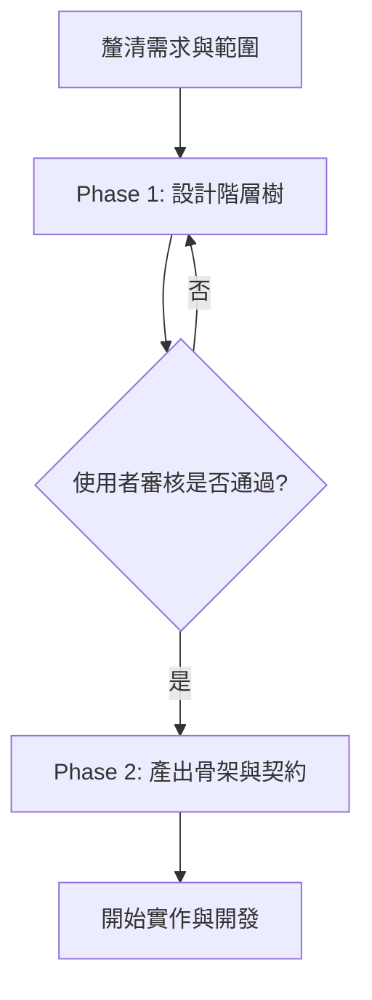

# 前端元件階層建立指南 (Component Hierarchy Guide)

本文件說明如何根據功能需求、使用者流程與線框圖（Wireframe）建立前端元件階層，並產出符合專案規範的 Vue SFC 骨架元件。

## 核心概念與工作流程

建立元件階層的目的是將複雜的產品需求，轉換為清晰、低耦合且具備明確職責的元件樹。

### 1. 介面拆解 (UI Decomposition)
* **自上而下 (Top-Down)**：從路由/頁面容器開始，拆解至功能區段，最後到展示型的葉節點元件。
* **層級適中**：階層深度建議控制在 **3-6 層**，避免過度設計或切分出過於微小的元件。

### 2. 職責與邊界 (Responsibilities & Boundaries)
* **區分元件類型**：
  * **容器元件 (Container Components)**：處理資料抓取 (Data Fetching)、非同步邊界、狀態管理與邏輯分發。
  * **展示元件 (Presentational/Leaf Components)**：負責 UI 呈現與互動，不包含副作用，資料與事件由外部傳入。

---

## 開發協作流程

在實際開發中，本專案實施 **兩階段交付與審核流程 (Two-Phase Review Gate)**：

### Phase 1：設計階層樹 (Review Required)
* **交付物**：僅輸出 **Mermaid 階層樹 (`graph TD`)** 供使用者審核。
* **限制**：在階層樹確認前，**禁止**產生或修改任何程式碼檔案。

### Phase 2：產出骨架與契約 (Direct Mode / Approved)
通過審核或在直接產出模式下，依序產出以下內容：
1. **階層樹 (Mermaid Graph)**。
2. **元件契約表 (Component Contract Table)**：定義元件名稱、父子關係、State、Props、Events 與 Composables 依賴。
3. **元件骨架檔案 (Component Scaffold Files)**：符合規範的 Vue SFC 骨架。
4. **邏輯骨架檔案 (Composable Scaffold Files)**：若有抽離邏輯，產出 TypeScript 簽名骨架。
5. **建置順序 (Implementation Sequence)**：自外殼到葉節點的建置順序。
