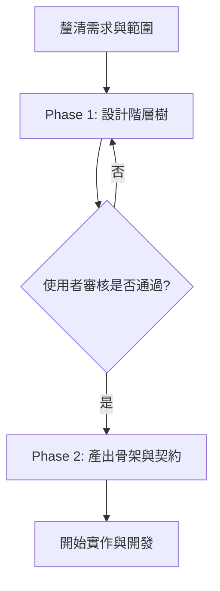

# 前端元件階層建立指南 (Component Hierarchy Guide)

本文件說明如何根據功能需求、使用者流程與線框圖（Wireframe）建立前端元件階層，並產出符合專案規範的 Vue SFC 骨架元件。

## 核心概念與工作流程

建立元件階層的目的是將複雜的產品需求，轉換為清晰、低耦合且具備明確職責的元件樹。

### 1. 介面拆解 (UI Decomposition)
* **自上而下 (Top-Down)**：從路由/頁面容器開始，拆解至功能區段，最後到展示型的元件。
* **層級適中**：階層深度建議控制在 **3-6 層**，避免過度設計或切分出過於微小的元件。
  * **防呆準則**：禁止將僅包含「單一狀態呈現」、「純靜態 CSS 樣式」或「單一圖標與文字」的區塊（例如：活動結束遮罩、按鈕內 Icon、標籤 Label）拆分為獨立元件。
  * **拆分條件**：僅在該區塊具備「複雜的內部互動與狀態」、「在多個不同父元件間高頻複用」或「有獨立非同步 UI 邊界」時，才考慮拆分為葉節點。

### 2. 職責與邊界 (Responsibilities & Boundaries)

建立元件階層主要專注於系統架構中的**「視圖呈現層 (Presentation Layer)」**。元件樹的資料與邏輯應透過 Composable 與架構的前三層（參數、請求、正規化）對接，避免元件本身包含過多非 UI 職責。

* **區分元件類型**：
  * **容器元件 (Container Components)**：作為呈現層的入口點與協調者。負責調用資料/邏輯 Composable 取得正規化後的資料，管理呈現層內部狀態、收集子元件事件，並控制非同步 UI 邊界（例如 Loading 與 Error 狀態）。**容器元件不直接處理 API 傳輸與原始資料的轉譯**。
  * **展示元件 (Presentational Components)**：純粹負責 UI 呈現與互動，無副作用。僅接收由外部傳入的標準化資料（經正規化層處理後之格式），並將操作事件向上傳遞，自身不依賴任何外部 Side Effect。

---

## 開發協作流程

在實際開發中，本專案實施 **兩階段交付與審核流程 (Two-Phase Review Gate)**：

### Phase 1：設計階層樹 (Review Required)
* **交付物**：僅輸出 **Mermaid 階層樹 (`graph TD`)** 供使用者審核。
* **限制**：在階層樹確認前，**禁止**產生或修改任何程式碼檔案。

### Phase 2：產出骨架與契約 (Direct Mode / Approved)
通過審核或在直接產出模式下，依序產出以下內容：
1. **階層樹 (Mermaid Graph)**。
2. **元件契約表 (Component Contract Table)**：定義元件名稱、父子關係、State、Props、Events 與 Composables 依賴。
3. **元件骨架檔案 (Component Scaffold Files)**：符合規範的 Vue SFC 骨架。
4. **邏輯骨架檔案 (Composable Scaffold Files)**：若有抽離邏輯，產出 TypeScript 簽名骨架。
5. **建置順序 (Implementation Sequence)**：自外殼到葉節點的建置順序。
