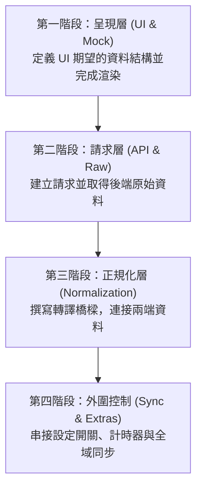

# 前端分層架構實作順序規範：先定義兩端，後造橋

本文件定義在分層架構下的程式碼實作順序。

在開發分層明確的複雜功能時，通常不會順著運作時的資料流（狀態 ➔ 請求 ➔ 正規化 ➔ 呈現）來寫程式碼。實務上最有效率且不易阻塞的開發策略是：**「先定義兩端（UI 與 API），最後再造橋（正規化）」**。

---

## 核心開發流程：四個實作階段

實務開發的實作順序建議為：
**1. 呈現層 (UI/Mock) ➔ 2. 請求層 (API/Raw) ➔ 3. 正規化層 (Mapping/Transform) ➔ 4. 狀態連動與外圍控制 (Sync/Toggles/Extras)**

### 第一階段：定義與實作「視圖呈現層（Presentation Layer）」 (UI 先行)
*   **核心作法：** 
    1. 根據畫面設計稿，定義出畫面最理想、最易渲染的標準化資料結構。
    2. 撰寫靜態的 **Mock Data**。
    3. 開發 UI 元件，直接將 Mock Data 餵給元件完成所有渲染與基礎樣式。
*   **核心價值：** 確保 UI 開發不受後端 API 開發進度的阻塞，並提早釐清畫面真正需要的資料型態。

---

### 第二階段：實作「參數層」與「資料請求層（Request Layer）」 (串接資料源)
*   **核心作法：**
    1. 處理使用者的輸入狀態（例如路由參數、分頁狀態、篩選條件），組裝成 API 預期的請求參數 (Payload)。
    2. 實作 API 請求。
    3. 確認前端能正確發送查詢條件，並順利取回後端最原始的資料回應（Raw Data）。
*   **核心價值：** 建立資料的「源頭」，確保網路通訊與參數傳遞無誤。

---

### 第三階段：實作「資料正規化層（Normalization Layer）」 (造橋與解耦)
*   **核心作法：**
    1. 開發轉譯邏輯，處理多變 API 的格式相容性與清洗。
    2. 將第二階段拿到的 **API 原始資料 (Raw Data)** 轉譯為第一階段定義好的 **標準化資料格式 (Mock Data Schema)**。
*   **核心價值：** 這是最重要的資料轉譯邊界。它把多變的 API 包裝形式收斂，讓 UI 呈現層與 API 徹底解耦。

---

### 第四階段：處理「外圍規格與全域連動」 (打通全域與互動邊界)
核心的主幹（API ➔ 正規化 ➔ 畫面）打通後，最後再處理主資料流之外的枝葉規格與控制邊界：
*   **視覺與設定開關 (UI Toggles)：** 
    *   實作控制元件視覺呈現的設定開關。
    *   *關鍵原則*：確保開關**只影響呈現層視覺，不直接改動資料來源，也不會觸發不必要的 API 請求**。
*   **輔助資訊運算 (Auxiliary Data)：**
    *   實作與核心表格無關的外圍規格。
*   **全域事件同步 (Global Sync)：**
    *   偵測關鍵狀態變化時，自動發起 `refetch`，重新驅動整條資料流（參數 ➔ 請求 ➔ 正規化 ➔ 渲染）。

---

## 結論

實務上遵循**「先兩端，後造橋」**的順序，不僅能讓前端開發不被後端進度阻塞，更能強迫開發者在初期就思考最貼合 UI 的型別合約 (Contract-First)，使得資料轉譯邊界 (Normalization Layer) 達到最高價值的解耦。
