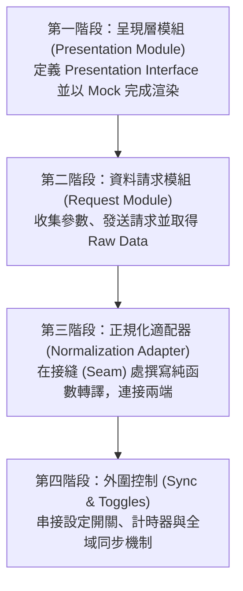

# 前端分層架構實作順序規範：先定義兩端 Interface，延後在接縫處造橋

本文件定義在分層架構下的程式碼實作順序。

在開發分層明確的複雜功能時，通常不會順著運作時的資料流（狀態 ➔ 請求參數 ➔ 適配器轉譯 ➔ 呈現）來寫程式碼。實務上最有效率且不易阻塞的開發策略是：**「先定義兩端模組的 Interface，延後實作連接兩者的 Normalization Adapter（正規化適配器）」**。

---

## 核心開發流程：四個實作階段

實務開發的實作順序建議為：
**1. 呈現層模組 (Presentation Module) ➔ 2. 資料請求模組 (Request Module) ➔ 3. 正規化適配器 (Normalization Adapter) ➔ 4. 狀態連動與外圍控制 (Sync/Toggles)**

### 第一階段：實作呈現層模組 (Presentation Module) (呈現先行)
*   **核心作法：** 
    1. 根據畫面設計稿，逆推並定義出最理想、最易渲染的 **呈現介面 (Presentation Interface)**。
    2. 撰寫符合該介面的靜態 **Mock Data**。
    3. 開發呈現層元件，直接將 Mock Data 餵給元件，完成所有渲染與互動樣式。
*   **核心價值：** 確保 UI 開發不受後端 API 進度阻塞。以介面合約驅動開發 (Contract-First)，提早確定畫面所需的最佳資料結構。

---

### 第二階段：實作資料請求模組 (Request Module) (串接資料源)
*   **核心作法：**
    1. 處理使用者的輸入狀態（如路由參數、分頁狀態、篩選條件），組裝成 API 預期的請求參數 (Payload)。
    2. 實作 API 請求與狀態（例如 loading、error 狀態）。
    3. 確認前端能正確發送查詢條件，並順利取回後端最原始的資料回應 (Raw Data)。
*   **核心價值：** 建立資料的「源頭」，確保網路通訊與參數傳遞無誤，確立兩端接縫的其中一端。

---

### 第三階段：實作正規化適配器 (Normalization Adapter) (接縫造橋與解耦)
*   **核心作法：**
    1. 在兩端模組的 **接縫 (Seam)** 處，開發轉譯適配器。
    2. 將第二階段拿到的 **API 原始資料 (Raw Data)** 轉譯為第一階段定義好的 **呈現介面 (Presentation Interface)** 格式。
    3. *設計要點*：適配器應為 **純函數 (Pure Function)**——「接收 Raw Data，返回 Presentation Interface，不產生副作用 (Side-effects)」。
*   **核心價值：** 這是系統中最重要的防腐邊界。它將多變的後端格式進行清洗，讓呈現層與資料請求層徹底解耦。
*   **刪除測試 (Deletion Test) 驗證**：若後端 API 規格大幅異動，或未來改用其他資料源，此時**複雜度的變更應只停留在該適配器內**。只要適配器轉出的格式仍滿足 Presentation Interface，呈現層模組（UI 元件）便可一字不改。

---

### 第四階段：處理外圍規格與全域連動 (打通控制邊界)
核心主幹（資料請求 ➔ 適配器 ➔ 呈現層）打通後，最後再處理主資料流之外的枝葉規格與控制邊界：
*   **視覺與設定開關 (UI Toggles)：** 
    *   實作控制元件視覺呈現的設定開關。
    *   *關鍵原則*：確保開關**只影響呈現層視覺，不直接改動資料來源，亦不會觸發不必要的 API 請求**。
*   **全域事件同步 (Global Sync)：**
    *   當偵測到關鍵狀態變化時，自動發起 `refetch`，重新驅動整條資料流（參數 ➔ 請求 ➔ 適配器 ➔ 呈現層）。

---

## 結論

遵循**「先兩端，後造橋」**的順序，不僅能讓前端不受後端進度阻塞，更能強迫開發者在初期就定義出優良的 **呈現介面 (Presentation Interface)**。這使資料在接縫 (Seam) 處的轉譯被乾淨地限制在 **正規化適配器 (Normalization Adapter)** 中，從而創造極佳的「局部性 (Locality)」與「測試槓桿 (Test Leverage)」。

