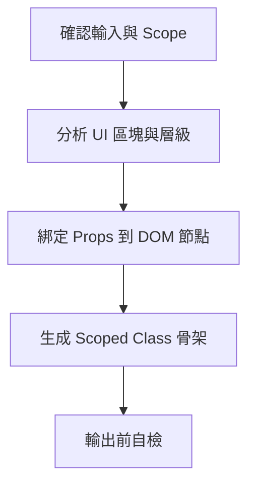

# 模板與樣式骨架建立指南 (Template DOM Hierarchy Guide)

本文件說明如何根據畫面截圖、線框圖或視覺設計稿，搭配已定義好 Props/Emits 契約的 Vue SFC，分析並建立單一元件的 `<template>` DOM 階層與 `<style>` 樣式類別骨架 (Class Skeleton)。

---

## 核心概念與目的

此階段的開發主要專注於**「結構定義與 scoped 隔離」**，在正式撰寫樣式或複雜行為前，先為元件打下穩固的結構地基：
* **視覺結構化**：將視覺設計拆解為語意化且具備階層感的 DOM 結構。
* **樣式隔離預留 (Scoped Skeleton)**：在 `<style>` 中僅產生 class selector 與空區塊，確保 class 名稱與 DOM 完全對應，提早做好 scoped style 的隔離規劃。
* **維持元件契約不變**：保持 `<script setup>` 內的核心 Props/Emits 契約不變，僅專注於 template 和 style skeleton 的產出。

---

## 邊界與限制（防呆準則）

為確保開發流程的聚焦與單一職責，本指南包含以下硬性限制：

1. **單一元件範疇 (Single Component Focus)**：
   * 僅處理目前指定的「單一元件」，不進行檔案拆分，不將視覺上的區塊強行抽離成新的子元件。
2. **無實際樣式宣告 (CSS-Free)**：
   * 在 `<style>` 區塊內**僅允許新增/調整對應的 class selectors 與空 block**（例如 `.Block__element {}`）。
   * **絕對禁止填入任何具體的 CSS 屬性**（如 `color`, `display`, `padding` 等）。
3. **維持 Script 契約穩定 (Immutable Script)**：
   * 不得修改 Props/Emits 的介面、型別、預設值或註解。
   * 僅允許在必要時，於 `<script setup>` 中新增控制純 UI 顯示或互動的 local state（如 `ref` 變數用以切換 Tab 或 Modal 狀態），**禁止撰寫複雜的資料轉換或 API/業務邏輯**。
4. **拒絕虛構數據**：
   * 若視覺稿有特定欄位需求，但既有 props 未定義，請於 template 中保留靜態占位文案（Placeholder），**禁止虛構 props** 或 props 欄位。

---

## 實作工作流程 (Workflow)



### 1. 確認輸入與 Scope
* 閱讀視覺輸入（截圖、線框或描述）以及既有 Vue SFC 檔案。
* 確認 `<script setup>` 已經宣告好核心 props/emits。

### 2. 分析 UI 區塊與層級
* **尋找 Root Container**：選定最適當的單一根節點（如 `article`、`section` 等）。
* **拆分主要區塊**：自上而下將 UI 劃分為幾個主要語意區塊（如 Header、Content、Footer）。
* **選用語意化節點**：善用 `article`、`header`、`section`、`ul/li`、`button` 等 HTML5 標籤，控制 DOM 深度，**避免為了排版產生多餘無語意 Wrapper**。

### 3. 綁定 Props 到 DOM 節點
* **文字與狀態**：將文字 props 綁定到對應節點（`{{ title }}`）。
* **媒體與資源**：將圖片或網址綁定到屬性（`:src="imageUrl"`、`:href="link"`），必要時加上 `v-if`。
* **列表與陣列**：使用 `v-for` 生成重複列表，並綁定穩定且唯一的 `:key`（若無 ID，則暫用 index 並註明風險）。

### 4. 生成 Scoped Class 骨架
* class 命名與 selector 規範一律遵循專案的 `Vue SFC Code Style（Single Source）`（採用 BEM 命名：`Block__elementName`）。
* 在 SCSS 內**禁用** `&__element` 縮寫，必須寫出完整類名。
* 在 `<style lang="scss" scoped>` 中同步補齊 template 所使用到的 class 結構，只留下空 block。

### 5. 輸出前自檢
* 確認 `<script setup>` 只有 UI local state (如顯示/隱藏 of ref)，無資料庫/API Side Effect。
* 確認 `<style>` 內沒有任何 CSS 樣式屬性，僅有 Class 結構。
* 確認無多餘的空節點，也沒有跨元件的 slot 依賴。

---

## 範本模式 (Scaffold Pattern)

一個合格的 Template DOM Hierarchy 輸出結構如下：

```vue
<template>
  <article class="ProductCard">
    <header class="ProductCard__header">
      
      <h3 class="ProductCard__title">{{ title }}</h3>
    </header>

    <section class="ProductCard__content">
      <p class="ProductCard__desc">{{ desc }}</p>
      <ul v-if="tags?.length" class="ProductCard__tags">
        <li v-for="(tag, index) in tags" :key="tag.id ?? index" class="ProductCard__tagItem">
          {{ tag.name }}
        </li>
      </ul>
    </section>

    <footer class="ProductCard__footer">
      <button class="ProductCard__btn" :class="{ disabled: isSoldOut }" @click="$emit('buy')">
        {{ isSoldOut ? '已售完' : '立即購買' }}
      </button>
    </footer>
  </article>
</template>

<script setup lang="ts">
// 核心 script 契約保持不變
interface ProductCardProps {
  title: string;
  desc: string;
  coverUrl?: string;
  tags?: { id: string; name: string }[];
  isSoldOut?: boolean;
}
defineProps<ProductCardProps>();
defineEmits<{ (e: 'buy'): void }>();
</script>

<style scoped lang="scss">
.ProductCard {
  .ProductCard__header {}
  .ProductCard__cover {}
  .ProductCard__title {}
  .ProductCard__content {}
  .ProductCard__desc {}
  .ProductCard__tags {}
  .ProductCard__tagItem {}
  .ProductCard__footer {}
  .ProductCard__btn {
    &.disabled {}
  }
}
</style>
```

---

## 常見反模式 (Anti-Patterns)

* ❌ **在 style 中填寫 CSS 樣式屬性**：例如在 `.ProductCard__title` 裡面寫 `color: red;`，此階段僅建立類別結構，不實作具體樣式。
* ❌ **未按 BEM 縮寫類名**：在 SCSS 裡面使用 `&__title {}` 進行縮寫（不符合 `Vue SFC Code Style` 規範，須寫完整類名）。
* ❌ **在 script setup 中加入非 UI 的複雜邏輯**：例如在此處直接實作 API 呼叫、資料格式轉換等。
* ❌ **過度設計與 Wrapper 濫用**：為了解決未來可能出現的排版，在 DOM 中包了三、四層無意義的 `div`。
* ❌ **隨意拆分元件**：看到圖片區塊就主動建一個 `ImageLoader.vue` 並把 props 丟過去。
