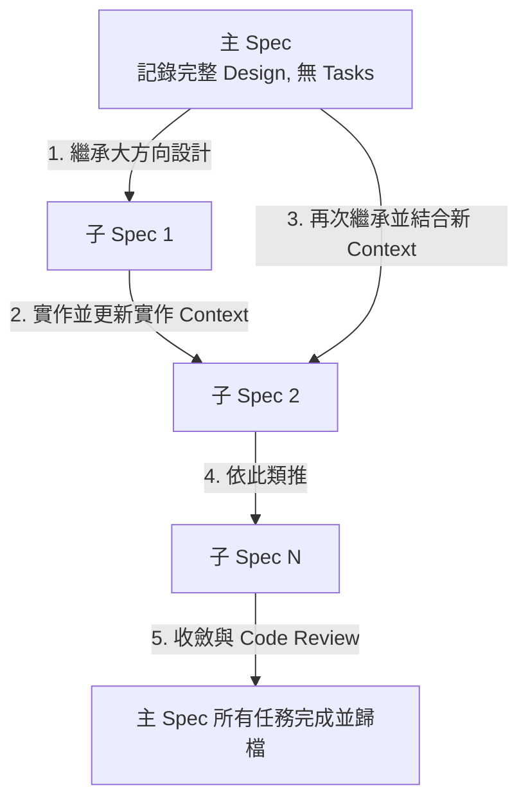

# OpenSpec 階層式工作流 (Hierarchical Workflow)

此工作流源自於實戰中對 OpenSpec 的最佳實踐蒸餾。當面對大型、複雜的功能開發時，傳統的一站式計畫（Propose）容易因為上下文（Context）過長而導致 AI 實作失焦或設計偏離。本工作流透過**「父子雙層架構」**與**「動態滾動式規劃」**來解決此痛點。

---

## 核心架構

### 1. 主 Spec (Parent Spec) - 全景藍圖
* **定位**：系統最終狀態的「全景藍圖」。
* **內容**：詳細記錄所有討論後的需求與技術設計（Design），但**不包含具體任務（Tasks）**。
* **目的**：保持高階設計的靈活性，避免過早細化任務導致計畫僵化。

### 2. 子 Spec (Child Spec) - 滾動式實作
* **定位**：將大功能拆解後的局部小型變更（Micro-Changes）。
* **內容**：僅針對當前小步驟的 `design.md` 與 `tasks.md`。
* **特點**：**當下動態產生**，做完一步才規劃下一步。

---

## 運作流程



1. **討論與奠基**：將所有討論細節與高階設計記錄於**主 Spec**。
2. **啟動子 Spec**：當要開始部分實作時，啟動一個**子 Spec**。
3. **繼承與生成**：
   * AI 回頭讀取**主 Spec** 的設計基準，確保不偏離架構。
   * AI 讀取**當前最新的程式碼狀態與上一輪實作 Context**。
   * 動態生成當前子 Spec 的 `design.md` 與 `tasks.md`。
4. **實作與審查**：執行 `/opsx:apply` 實作子 Spec 任務，並進行 Code Review。
5. **滾動循環**：重複步驟 2~4，直至主 Spec 所規劃的所有需求皆實作完畢。

---

## 實務操作範例：購物車功能開發

以下示範如何將大型功能「購物車 (Shopping Cart)」拆解為階層式工作流來逐步執行：

### 階段 1：建立大方向設計（主 Spec）
首先建立主 Spec 來統籌整體的架構藍圖。

```bash
# 1. 建立一個專屬於「購物車主體」的 Change
/opsx:new shopping-cart-main

# 2. 與 AI 進行充分討論，把整個購物車的需求和系統架構寫入主 Spec 中
# 這時會產生 proposal.md 與 design.md
# ⚠️ 注意：此時不開 Task 清單，也不執行實作。
```

### 階段 2：拆分小步實作（子 Spec 滾動執行）
主 Spec 定好後，開始將實作拆成數個子 Spec，做完一步才規劃下一步。

#### 步驟 1：實作資料庫與 API
```bash
# 1. 建立第一個子 Spec
/opsx:new shopping-cart-db-api

# 2. 生成此子 Spec 的規劃
/opsx:continue
# AI 會回頭讀取 shopping-cart-main 的大架構，僅針對當下需要的 DB Schema 與 API 路由生成 design.md 與 tasks.md

# 3. 實作與封存歸檔
/opsx:apply
/opsx:archive
```

#### 步驟 2：實作購物車運算邏輯（如折扣計算）
```bash
# 1. 建立第二個子 Spec
/opsx:new shopping-cart-discount-logic

# 2. 生成規劃
/opsx:continue
# AI 會參考主 Spec 設計，並讀取「上一步已歸檔的 API 程式碼 (Context)」，進而生成折扣邏輯的 tasks.md

# 3. 實作與封存歸檔
/opsx:apply
/opsx:archive
```

#### 步驟 3：實作前端 UI 介面
```bash
# 1. 建立第三個子 Spec
/opsx:new shopping-cart-ui

# 2. 生成規劃
/opsx:continue
# AI 讀取主 Spec 與已完成的 API、折扣邏輯，規劃 UI 元件開發任務

# 3. 實作與封存歸檔
/opsx:apply
/opsx:archive
```

### 階段 3：主 Spec 歸檔（功能開發結束）
所有子 Spec 的實作都完成，並通過 Code Review 後：

```bash
# 最後將一開始建立的「購物車主體」歸檔，宣告該大功能正式上線
/opsx:archive shopping-cart-main
```

---

## 核心優勢

* **減輕 Context 負擔**：AI 在實作時只需關注當前子 Spec 的微小 Tasks，顯著降低幻覺與失焦率。
* **動態適應 (Learn-by-doing)**：前一步實作踩坑時，下一步的子 Spec 可即時在設計階段修正，不需重寫整個大計畫。
* **架構一致性**：每一次子 Spec 啟動都會強制讀取主 Spec，確保多個子模組的風格與技術決策高度一致。
